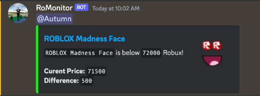

# RoMonitor
<p align="center">


</p>

An advanced Roblox item monitoring application to alert you on item updates, from the people who made the RoWhoIs bot.




## Setting it up

1. Create a [Discord Webhook](https://discord.com/safety/using-webhooks-and-embeds#title-3)
2. Clone, or download, this repository
```bash
git clone https://github.com/RoWhoIs/RoMonitor --depth=1 && cd RoMonitor
```
3. Modify `config.json` to include your webhook key and roblosecurity.
4. Run romonitor.py
```bash
python3 romonitor.py -ri 130213380 -t 30 -m 72000
```
<sub>Example command. This will run forever, check the item every 30 seconds, and send an alert if the item is below 75,000 Robux. </sub>

## Usage

| Operand         | Description                                      | Required? | Default |
|:----------------|:-------------------------------------------------|:----------|:--------|
| -i/--item       | Chooses what item to monitor                     | Yes       | None    |
| -M/--mention    | Choose who the bot will mention                  | No        | None    |
| -t/--time       | Choose how frequently to scan the item (seconds) | No        | 60      |
| -m/--minprice   | Choose the minimum price for an alert            | No        | 0       |
| -r/--runforever | Runs RoMonitor even after a notification         | No        | False   |

## Troubleshooting

> Unable to renew token

This issue is most likely caused due to a new Roblox feature, Account Session Protection, which makes it impossible to get tokens required for requests.
To resolve this, head to your [advanced creator settings](https://create.roblox.com/settings/advanced) and disable it.

If you don't want to disable this on your account, create a new account and disable it there.

> Not actually pinging anyone

This is most likely due to you not inputting a proper Discord User ID. To do so, go to the advanced tab in settings, enable Developer Mode, and right click "Copy User ID" on the person you would like pinged.

If that isn't the case, it may be your webhook url. Check the configuration settings and try again.

> How do I check if the program is actually doing anything?

You can check if the program is operating normally by enabling `debug` in `config.json`.
